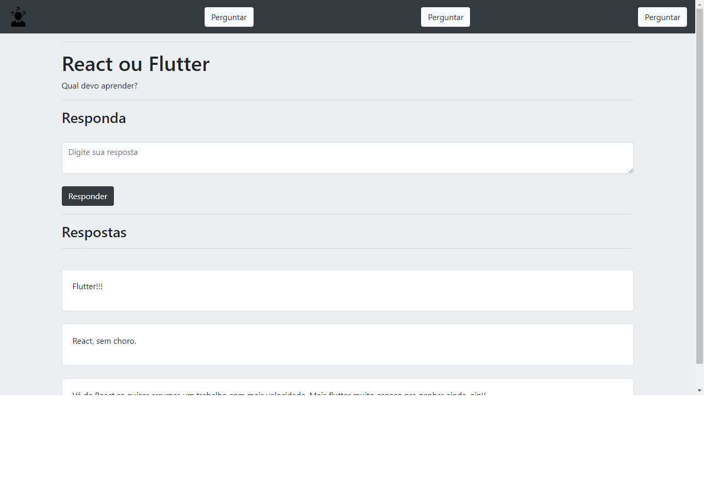

# AskVini
<h1 align="center">
    Ask Vinícius!
</h1>

Aplicação para fixar aprendizado em node.js utilizando o express.

📌 Um pouco da aplicação:
------------------

🔧 Tecnologias utilizadas:
------------------

- JAVASCRIPT
- HTML5
- Bootstrap
- NODE.js
- EXPRESS.js
- EJS
- SQL

💬 Fale comigo
------------------
[*LinkedIn*](https://www.linkedin.com/in/vgfranca)

Obrigado por chegar até aqui! 🚀

------------------

Projeto orientado por Mayk Brito - RocketSeat.

